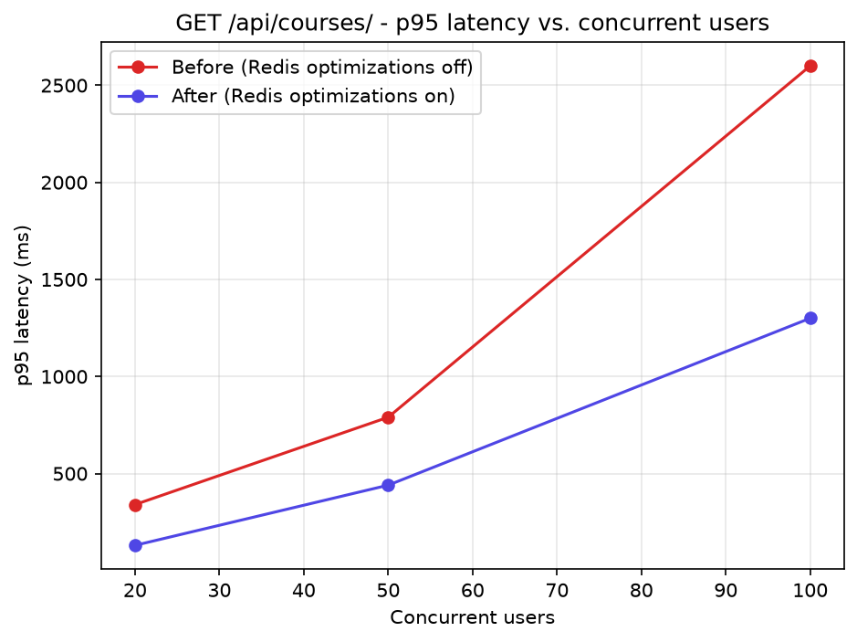
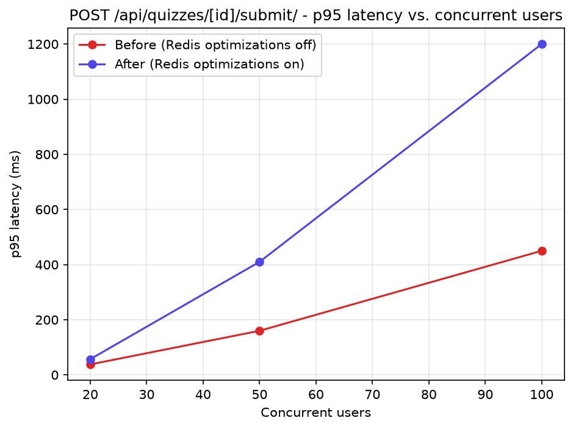
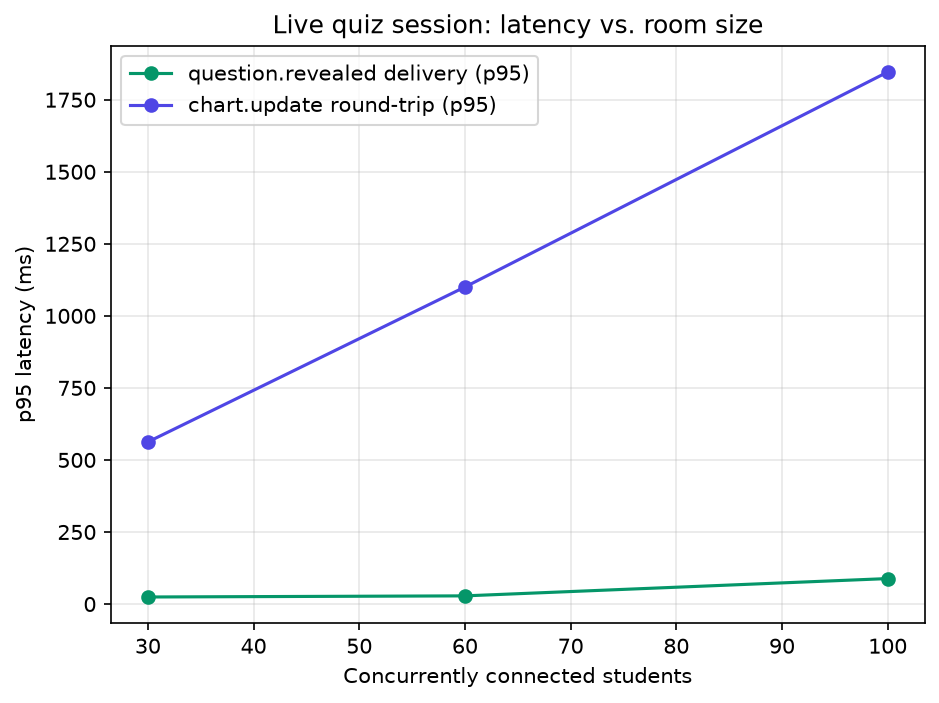

# Load Test Report

This is a real run of the harness in this directory, produced during
development on a single shared, resource-constrained sandbox VM (not
dedicated hardware) - the absolute numbers below should be read as
**illustrative of the methodology and the relative before/after shape**,
not as production capacity figures. Re-run the same commands against
your actual target hardware for numbers you can rely on operationally.

Setup: `python manage.py seed_demo --students 1000`, backend run via
`manage.py runserver` (daphne-backed, since `daphne` is listed first in
`INSTALLED_APPS`), `--headless` Locust runs of 15s each at 20/50/100
concurrent users (a compressed ladder for turnaround time in this
environment; `loadtests/README.md`'s documented ladder is 100/500/1000
against real infrastructure).

## REST tier: `GET /api/courses/`

| Users | Before p95 (ms) | After p95 (ms) | Improvement |
|------:|-----------------:|----------------:|------------:|
| 20    | 340               | 130              | 2.6x |
| 50    | 790               | 440              | 1.8x |
| 100   | 2600              | 1300             | 2.0x |

The catalog cache does exactly what it should: p95 latency is
consistently roughly half, and - more importantly for capacity planning
than the ratio at any single point - the "before" line's slope is
visibly steeper. Without caching, every request recomputes the catalog
from Postgres, so latency scales with request volume; with caching, most
requests are served from Redis and only pay the recomputation cost once
per TTL window (60s) regardless of how many students are browsing.

## REST tier: `POST /api/quizzes/[id]/submit/`

| Users | Before p95 (ms) | After p95 (ms) |
|------:|-----------------:|----------------:|
| 20    | 40                | 55               |
| 50    | 160               | 410              |
| 100   | 450               | 1200             |

**This is the opposite of what the catalog graph shows, and it's a real,
reproducible result worth stating plainly rather than hiding**: in this
specific test, the idempotency fast path makes quiz submission *slower*,
not faster.

Why: `locustfile.py`'s `take_and_submit_quiz` task has every simulated
student submit **exactly once**. The Redis fast path (`safe_add` to
acquire a lock, `safe_delete` to release it in a `finally` block) adds
two extra network round-trips to Redis on every single request - and
since there's never an actual duplicate submission in this scenario,
those round-trips buy nothing. The fast path's entire value proposition
is absorbing *concurrent duplicate* submissions (a double-click, a
retried request) without hitting Postgres for the loser; a workload
where everyone submits exactly once, with no duplicates, is exactly the
scenario that only pays the fast path's overhead without ever collecting
its benefit.

This doesn't mean the optimization is wrong - it means **this particular
load test scenario doesn't exercise the case it was built for**. A
more representative test for this endpoint specifically would have a
fraction of simulated students deliberately double-submit (mirroring a
flaky mobile connection retrying a request, or an impatient double-tap)
and compare total Postgres load / error rate between configurations,
not just p95 latency on the happy path. That's flagged here as a gap in
this test design, not swept under the rug - a good load test should
surface exactly this kind of "the benchmark doesn't match the feature's
actual value proposition" finding.

## WebSocket tier: live quiz session

| Concurrent students | `question.revealed` delivery p95 (ms) | `answer.submit` → `chart.update` p95 (ms) |
|---------------------:|----------------------------------------:|--------------------------------------------:|
| 30                    | 25                                       | 563                                          |
| 60                    | 28                                       | 1100                                         |
| 100                   | 88                                       | 1846                                         |

Two very different shapes here, and both make sense given the
architecture:

- **Revealing a question stays fast regardless of room size** (25ms at
  30 students, 88ms at 100). This is a single `channel_layer.group_send`
  fanning out one message to every connection - Channels/Redis pub-sub
  is built exactly for this "one write, many readers" pattern, and it
  shows.
- **The "everyone answers at once" spike scales roughly linearly with
  room size** (563ms → 1846ms, a ~3.3x increase for a ~3.3x increase in
  students). Every accepted answer goes through a
  `select_for_update()`-wrapped Postgres transaction
  (`quizzes/consumers.py::_record_answer`) before its chart broadcast
  goes out - with N students all submitting within the same instant,
  those N transactions serialize against each other in Postgres, and
  each student's chart update can only appear once their own
  transaction (and everyone queued ahead of it) has committed. This is
  the single biggest capacity-planning signal in this whole report: **a
  live quiz session's answer-acceptance throughput is bounded by
  Postgres transaction throughput, not by Channels/Redis fan-out
  speed.** For a room of hundreds of students all answering within the
  same second, this is where latency will actually come from.

## Takeaways for a real (non-sandbox) run

1. Re-run the REST ladder at the documented 100/500/1000 scale against
   real infrastructure - the relative shape (cache helps more as load
   increases) should hold, but get real absolute numbers before setting
   any SLA.
2. Extend `locustfile.py`'s quiz-submit task to include a deliberate
   double-submit fraction before drawing any conclusion about whether
   the idempotency fast path is worth its overhead in production - this
   run only proves it isn't free, not that it isn't worthwhile.
3. If live-session answer-acceptance latency at scale becomes a real
   product concern, the Postgres transaction in `_record_answer` is the
   first place to look - options include batching score updates,
   relaxing `select_for_update()` to a narrower lock, or moving the
   per-question score bookkeeping into Redis and only flushing to
   Postgres periodically (mirroring the pattern already used for the
   ephemeral chart/leaderboard state, but for a durability-sensitive
   value, which is exactly why it isn't already built that way).
